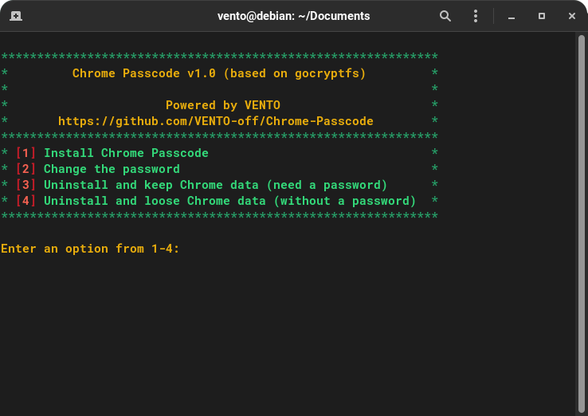

# Chrome Passcode

A small script for **Debian/Ubuntu** which allows user to set a password for Google Chrome to avoid unauthorized access.
Prompts for password on browser startup.

> Note: Chrome Passcode adds an extra protection for the browser. 
> All the Google Chrome **data are encrypted** with [gocryptfs](https://github.com/rfjakob/gocryptfs).


## Installation

Run the following command in the terminal:
```
sudo bash install.sh
```

The main menu will appear which allows to manage Chrome Passcode script:
1. Install Chrome Passcode
2. Change the password which unlocks Google Chrome
3. Uninstall Chrome Passcode and keep all the browser data
4. Uninstall Chrome Passcode and loose browser data



## Algorithm

### Browser Data Encryption

All the Google Chrome data (e.g. sessions, cookies, history, saved passwords etc.) are stored in the `/home/$USER/.config/google-chrome/Default/` directory.

After Chrome Passcode installation is completed, all the browser data encrypts with your password and stores in the `/home/$USER/.config/google-chrome/Default.encrypted/` directory.

After that the `/home/$USER/.config/google-chrome/Default/` directory becomes empty.

### Google Chrome startup

When Google Chrome starts, it prompts for a password.

#### Password correct:

- The browser data decrypts and mounts to the `/home/$USER/.config/google-chrome/Default/` directory. Decrypted directory will stay mounted until system reboot. So, you need to enter a password only at first Google Chrome startup.
   
- While using Google Chrome, all the data encrypts back to the encrypted directory in real time. So, your encrypted browser data will be always up-to-date.

- After system shutdown, the decrypted directory will be automatically unmounted. So, your browser data won't be accessible until you enter a password.

#### Password incorrect:

- The browser data won't be decrypted and Google Chrome won't start.
   